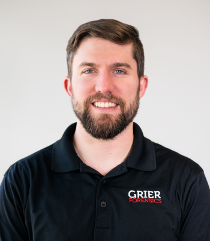

% About

I am a software developer employed by the Functional MRI Facility at the
National Institute of Mental Health. My work consists of website development,
database design, development of medical image reconstruction software,
and construction of various end-user command-line tools.

In my spare time I enjoy studying programming language design and runtime
implementations. I also like learning *new* programming languages and APIs,
experimenting with embedded systems, and hacking on website backends.
